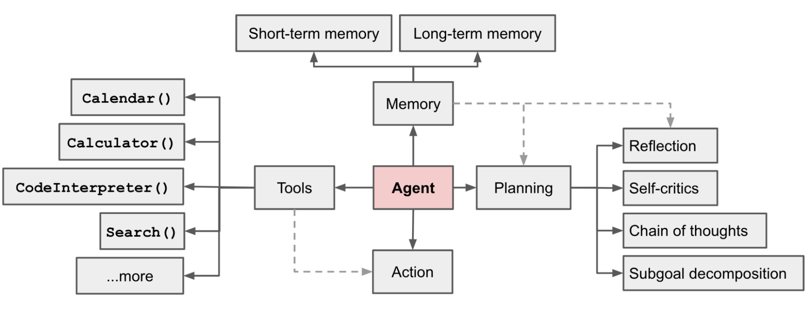
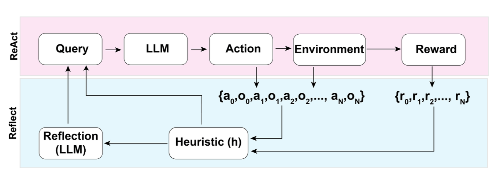

# LLM Powered Autonomous Agents

[Source: https://lilianweng.github.io/posts/2023-06-23-agent/](https://lilianweng.github.io/posts/2023-06-23-agent/)

Key insights on building LLM agents from the blog include:

1. **Task Decomposition** : Breaking down complex tasks into manageable subgoals is crucial.
2. **Memory Management** : Effective memory systems are needed to store and retrieve past actions and knowledge.
3. **Tool Use** : Integrating external APIs and tools enhances the agent's capabilities.
4. **Planning and Reflection** : Techniques like Chain of Thought, ReAct, and Reflexion help in planning and self-assessment.
5. **Real-World Applications** : Applications range from scientific discovery to simulating generative agents.




Task decomposition:

- Chain of Thought: "think step-by-step"
- Tree of thought
  - "steps for xyz"
  - "what are subgoals for achieving XYZ"
  - External Tool to break down tasks using domain specific language, then translate back to natural language
    - [Paper](https://arxiv.org/abs/2304.11477)
- 

Self-Reflection

- **ReAct**
  - Integrates reasoning and acting
  - Template:
    - Thought: ...
    - Action: ...
    - Observation: ...
    - Repeat n times
- Reflexion
  - RL-based approach
  - 
  - Heuristic function evaluates the quality of planning and determines whether the trajectory contains error or is inefficient.
  - showing two shot example to the llm
    - each example contains
      - failed trajectory
      - ideal reflection for guiding future changes in the plan
    - add examples to agent's working memory as context
      - up to 3 examples
- [Chain of Hindsight](https://arxiv.org/abs/2302.02676)
  - explicitly present model its past output with human annotated feedback
  - The model is finetuned to only predict 𝑦𝑛 where conditioned on the sequence prefix, such that the model can self-reflect to produce better output based on the feedback sequence. The model can optionally receive multiple rounds of instructions with human annotators at test time.

#### Memory

* Sensory memory as learning embedding representations for raw inputs, including text, image or other modalities;
* Short-term memory as in-context learning. It is short and finite, as it is restricted by the finite context window length of Transformer.
* Long-term memory as the external vector store that the agent can attend to at query time, accessible via fast retrieval.

The external memory can alleviate the restriction of finite attention span. A standard practice is to save the embedding representation of information into a vector store database that can support fast maximum inner-product search ([MIPS](https://en.wikipedia.org/wiki/Maximum_inner-product_search)). To optimize the retrieval speed, the common choice is the *approximate nearest neighbors (ANN)* algorithm to return approximately top k nearest neighbors to trade off a little accuracy lost for a huge speedup.


* [**FAISS**](https://github.com/facebookresearch/faiss) (Facebook AI Similarity Search): It operates on the assumption that in high dimensional space, distances between nodes follow a Gaussian distribution and thus there should exist *clustering* of data points. FAISS applies vector quantization by partitioning the vector space into clusters and then refining the quantization within clusters. Search first looks for cluster candidates with coarse quantization and then further looks into each cluster with finer quantization.


#### Tool Use


**HuggingGPT** ([Shen et al. 2023](https://arxiv.org/abs/2303.17580)) is a framework to use ChatGPT as the task planner to select models available in HuggingFace platform according to the model descriptions and summarize the response based on the execution results.


The system comprises of 4 stages:

 **(1) Task planning** : LLM works as the brain and parses the user requests into multiple tasks. There are four attributes associated with each task: task type, ID, dependencies, and arguments. They use few-shot examples to guide LLM to do task parsing and planning.

**(2) Model selection** : LLM distributes the tasks to expert models, where the request is framed as a multiple-choice question. LLM is presented with a list of models to choose from. Due to the limited context length, task type based filtration is needed.

**(3) Task execution** : Expert models execute on the specific tasks and log results.

**(4) Response generation** : LLM receives the execution results and provides summarized results to users.


#### Case Study: AutoGPT

##### AutoGPT's Prompt


```markdown
You are {{ai-name}}, {{user-provided AI bot description}}.
Your decisions must always be made independently without seeking user assistance. Play to your strengths as an LLM and pursue simple strategies with no legal complications.

GOALS:

1. {{user-provided goal 1}}
2. {{user-provided goal 2}}
3. ...
4. ...
5. ...

Constraints:
1. ~4000 word limit for short term memory. Your short term memory is short, so immediately save important information to files.
2. If you are unsure how you previously did something or want to recall past events, thinking about similar events will help you remember.
3. No user assistance
4. Exclusively use the commands listed in double quotes e.g. "command name"
5. Use subprocesses for commands that will not terminate within a few minutes

Commands:
1. Google Search: "google", args: "input": "<search>"
2. Browse Website: "browse_website", args: "url": "<url>", "question": "<what_you_want_to_find_on_website>"
3. Start GPT Agent: "start_agent", args: "name": "<name>", "task": "<short_task_desc>", "prompt": "<prompt>"
4. Message GPT Agent: "message_agent", args: "key": "<key>", "message": "<message>"
5. List GPT Agents: "list_agents", args:
6. Delete GPT Agent: "delete_agent", args: "key": "<key>"
7. Clone Repository: "clone_repository", args: "repository_url": "<url>", "clone_path": "<directory>"
8. Write to file: "write_to_file", args: "file": "<file>", "text": "<text>"
9. Read file: "read_file", args: "file": "<file>"
10. Append to file: "append_to_file", args: "file": "<file>", "text": "<text>"
11. Delete file: "delete_file", args: "file": "<file>"
12. Search Files: "search_files", args: "directory": "<directory>"
13. Analyze Code: "analyze_code", args: "code": "<full_code_string>"
14. Get Improved Code: "improve_code", args: "suggestions": "<list_of_suggestions>", "code": "<full_code_string>"
15. Write Tests: "write_tests", args: "code": "<full_code_string>", "focus": "<list_of_focus_areas>"
16. Execute Python File: "execute_python_file", args: "file": "<file>"
17. Generate Image: "generate_image", args: "prompt": "<prompt>"
18. Send Tweet: "send_tweet", args: "text": "<text>"
19. Do Nothing: "do_nothing", args:
20. Task Complete (Shutdown): "task_complete", args: "reason": "<reason>"

Resources:
1. Internet access for searches and information gathering.
2. Long Term memory management.
3. GPT-3.5 powered Agents for delegation of simple tasks.
4. File output.

Performance Evaluation:
1. Continuously review and analyze your actions to ensure you are performing to the best of your abilities.
2. Constructively self-criticize your big-picture behavior constantly.
3. Reflect on past decisions and strategies to refine your approach.
4. Every command has a cost, so be smart and efficient. Aim to complete tasks in the least number of steps.

You should only respond in JSON format as described below
Response Format:
{
    "thoughts": {
        "text": "thought",
        "reasoning": "reasoning",
        "plan": "- short bulleted\n- list that conveys\n- long-term plan",
        "criticism": "constructive self-criticism",
        "speak": "thoughts summary to say to user"
    },
    "command": {
        "name": "command name",
        "args": {
            "arg name": "value"
        }
    }
}
Ensure the response can be parsed by Python json.loads

```


```json
[
  {
    "role": "system",
    "content": "You will read instructions and not carry them out, only seek to clarify them.\nSpecifically you will first summarise a list of super short bullets of areas that need clarification.\nThen you will pick one clarifying question, and wait for an answer from the user.\n"
  },
  {
    "role": "user",
    "content": "We are writing {{a Super Mario game in python. MVC components split in separate files. Keyboard control.}}\n"
  },
  {
    "role": "assistant",
    "content": "Summary of areas that need clarification:\n1. Specifics of the Super Mario game (e.g. level design, characters, gameplay mechanics)\n2. Details about the MVC components (e.g. which components are in each file)\n3. Keyboard control implementation (e.g. which keys to use, how to handle input)\n\nClarifying question:\nCan you provide more details about the Super Mario game, such as level design, characters, and gameplay mechanics?"
  },
  {
    "role": "user",
    "content": "{{There are 10 levels in total. The main character is a plumber named Mario, who can walk and jump. It is a classical platform game just like Super Mario. The main character moves from left to right, trying to get to the destination, where there are many obstacles and attacks from enemies in the process.}}\n\nIs anything else unclear? If yes, only answer in the form:\n{remaining unclear areas} remaining questions.\n{Next question}\nIf everything is sufficiently clear, only answer \"Nothing more to clarify.\"."
  },
  {
    "role": "assistant",
    "content": "Remaining unclear areas: 2 remaining questions.\nCan you provide more information about how the MVC components are split into separate files?"
  },
  {
    "role": "user",
    "content": "{{Make your own assumptions and state them explicitly before starting}}"
  }
]

```


Code Writing Mode with a different set of system message:

```markdown
You will get instructions for code to write. You will write a very long answer. Make sure that every detail of the architecture is, in the end, implemented as code. Make sure that every detail of the architecture is, in the end, implemented as code.
Think step by step and reason yourself to the right decisions to make sure we get it right. You will first lay out the names of the core classes, functions, methods that will be necessary, as well as a quick comment on their purpose.

Then you will output the content of each file including ALL code. Each file must strictly follow a markdown code block format, where the following tokens must be replaced such that FILENAME is the lowercase file name including the file extension, LANG is the markup code block language for the code’s language, and CODE is the code:

FILENAME

``` CODE 
```

You will start with the “entrypoint” file, then go to the ones that are imported by that file, and so on. Please note that the code should be fully functional. No placeholders.

Follow a language and framework appropriate best practice file naming convention. Make sure that files contain all imports, types etc. Make sure that code in different files are compatible with each other. Ensure to implement all code, if you are unsure, write a plausible implementation. Include module dependency or package manager dependency definition file. Before you finish, double check that all parts of the architecture is present in the files.

Useful to know: You almost always put different classes in different files. For Python, you always create an appropriate requirements.txt file. For NodeJS, you always create an appropriate package.json file. You always add a comment briefly describing the purpose of the function definition. You try to add comments explaining very complex bits of logic. You always follow the best practices for the requested languages in terms of describing the code written as a defined package/project.

Python toolbelt preferences:

pytest
dataclasses
```
